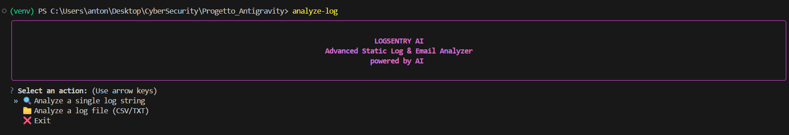
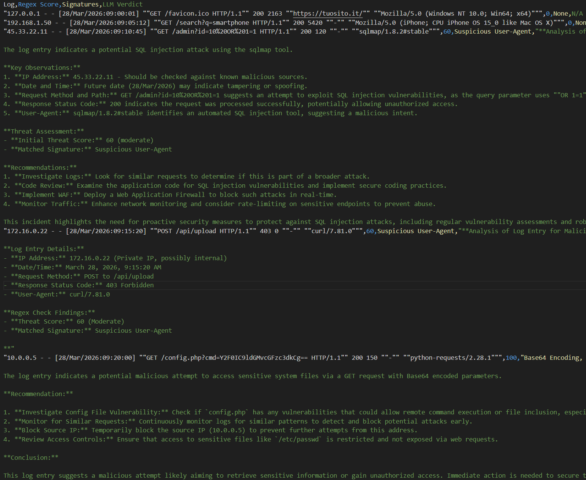

Read this in: [English](README.md) | [Italiano](README_IT.md)

# 🛡️ LogSentry AI - Intelligent Local Log Analyzer

[](https://opensource.org/licenses/MIT)
[](https://www.python.org/downloads/)
[](https://github.com/Textualize/rich)

**LogSentry AI** is a privacy-first, hybrid cybersecurity tool designed for local security auditing. It seamlessly integrates a blazing-fast Regex scoring engine with an advanced Local Large Language Model (e.g., DeepSeek-R1 via LM Studio) to identify anomalies, phishing attempts, and malicious payloads directly on your machine. No data leaves your network!

---

## 🔒 Why LogSentry AI?
- **Zero Data Leakage**: All analysis runs 100% locally on your machine. You can confidently audit sensitive production logs or emails without risking data leaks to external APIs or third-party cloud models.
- **Hybrid Architecture**: Why rely solely on AI hallucinations or rigid static rules? LogSentry utilizes a two-tier approach. A deterministic Regex Engine quickly filters the noise, and a powerful local reasoning LLM (like DeepSeek-R1) provides deep, contextual analysis only for the high-risk anomalies.

## ⚙️ Workflow
1. **Regex Filter**: Ingests massive `.csv` or `.txt` sets. Scans lines against established attack signatures like SQLi, Path Traversal, obfuscated Base64, and XSS.
2. **Risk Scoring**: Each matched signature cumulatively builds a dynamic "Threat Score".
3. **DeepSeek Reasoning**: If the Threat Score surpasses the safety threshold (default: 50), the system dynamically routes the log to a local LLM API for an advanced cybersecurity verdict, parsing the model's inner reasoning string securely.

## ✨ Core Features
- **Interactive TUI**: A beautiful, keyboard-navigable Terminal User Interface powered by `rich` and `questionary`.
- **Bulk Pandas Processing**: Process massive log files seamlessly with real-time `tqdm` progress tracking.
- **Timestamped Reporting**: Automatically generates secure, time-stamped `audit_report_YYYYMMDD_HHMMSS.csv` files containing clean, actionable LLM incident response verdicts.

## 📸 Screenshots



## 📋 Prerequisites
- **Python 3.10+**
- **LM Studio** (Running a local server model like DeepSeek-R1, Llama, or Qwen).

---

## 🚀 Installation

Ensure you have cloned or downloaded this repository. Then set up the environment based on your Operating System:

### Clone the Repository
```bash
git clone git@github.com:isilderrr1/LogSentry-AI.git
cd LogSentry-AI
```

### Windows
```powershell
# 1. Create a virtual environment
python -m venv venv

# 2. Activate the environment
.\venv\Scripts\Activate.ps1

# 3. Install the application and dependencies
pip install -e .
```

### macOS / Linux
```bash
# 1. Create a virtual environment
python3 -m venv venv

# 2. Activate the environment
source venv/bin/activate

# 3. Install the application and dependencies
pip install -e .
```

---

## 💻 Usage

### 1. The Interactive TUI
To launch the beautiful interactive Terminal User Interface, simply run the global command from anywhere within the virtual environment:
```bash
logsentry
```

### 2. Legacy Scripting CLI
For CI/CD or lightweight automation scripting, you can bypass the TUI and execute the core package module directly:
```bash
python -m src.cli.main analyze "GET /admin?user=root' OR 1=1--"
```

---

## 🧠 AI Setup (LM Studio)
To configure your local AI endpoint:
1. Open **LM Studio** and start the local inference server.
2. The code defaults to `http://10.5.0.2:1234/v1` (if your LM Studio operates purely on localhost, adjust the IP in `src/core/llm_analyzer.py` to `http://localhost:1234/v1`).
3. Update the `model` parameter string inside `src/core/llm_analyzer.py` to match the exact model you loaded (e.g., `deepseek-r1-distill-qwen-14b`).

## 📄 License
This project is licensed under the MIT License.
